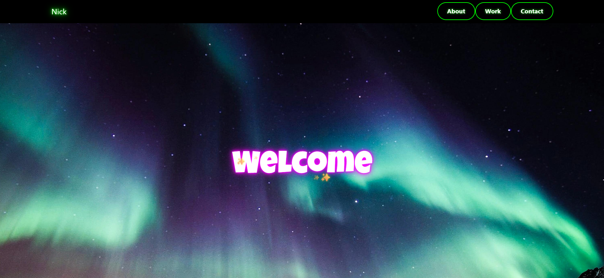

# Resume Portfolio Website

[]()
[]()
[]()
[]()
[]()
[]()
[](LICENSE)
[](https://yourusername.github.io)

This is my personal resume portfolio website built using **HTML**, **CSS**, **JavaScript**, and **Flask**. 
This website provides details on who I am, the work I have done, my certifications, and my contact information in an interactive, responsive and neon layout.
I have originally built this website with a Python Flask app structure and left the relevant files (and folder structure) for those who wish to use this website as a template skeleton for their own Flask website. However, I have also ensured it can be hosted on GitHub Pages by making a copy of the HTML file in the main folder.

## Features
- Neon-themed UI with hover effects and animations.
- Interactive mouse trail and smooth scroll effects.
- Contact section with buttons linking to:
  - Resume (downloadable PDF)
  - LinkedIn
  - GitHub
  - Tableau Public
  - NovyPro
- Work Experience section with embedded certification badges.
- Fully responsive design.

## Folder Structure
```bash
Website/
├── app.py
├── static/
│   ├── css/
│       └── style.css
│   ├── js/
│       └── main.js
│   └── resume/
│       └── Nicholas Seah Resume.pdf
│   ├── img/
│       └── cert_badges/
│           ├── Nick1.jpeg
│           ├── Nick2.png
│           ├── Nick3.jpg
│           ├── northern_lights.jpg
│           ├── Alteryx Core Cert.png
│           ├── PCAP Certificate.png
│           └── Tableau Data Analyst Cert.png
├── templates/
│   └── index.html
└── README.md 
```

## Built With
- HTML
- CSS
- JavaScript
- Flask (Python)
- Bootstrap

## 💻 How to Run Locally
1. Clone the repository:
   ```bash
   git clone https://github.com/yourusername/your-repo-name.git

2. Navigate into the folder by running the below:
    ```bash
    cd Website

3. Install dependencies (Flask):
    ```bash
    pip install flask

4. Run the app:
    ```bash
    python app.py

5. Open in browser at the following address:
    ```bash
    http://127.0.0.1:5000/
    
## Preview


## Live Demo
Website here: 

## Author
Nicholas Seah
[LinkedIn](https://www.linkedin.com/in/nicholas-seah8/) | [GitHub](https://github.com/NickSeah8)

